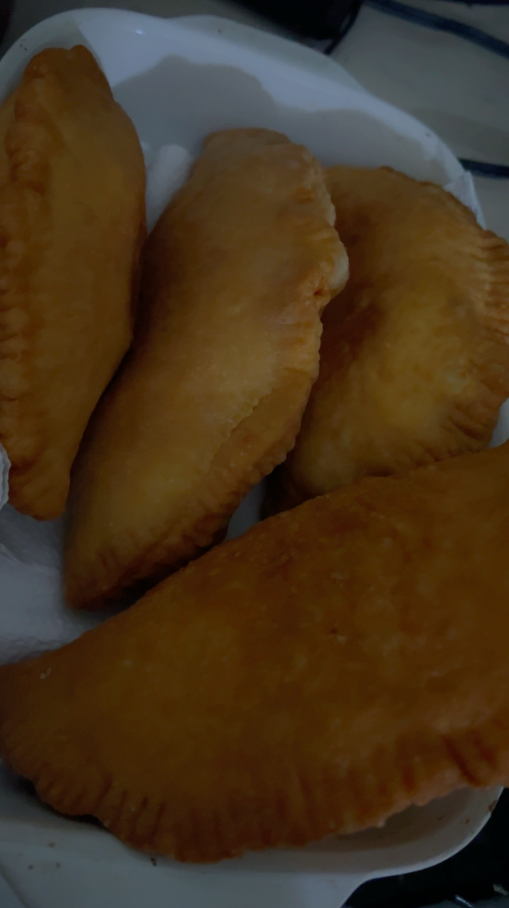

# Bites & Bubbly 

## Intro
I'm trying to build a cool web app for a brunch spot, allowing customers to make a reservation on their own rather than having to call to do so.

#### Technologies Used: 

- **Programming Languages:** HTML, JavaScript, Css,
- **Development Tools:**
    - **Visual Studio Code**
    - **Wireframe.cc**
    - **Git Hub**
- **Web Browsers:**
    - **Google Chrome**
    - **Safari**
    - **Firefox**

---

### **_Getting Started_**

On the web app, go to reservations and inquiry and submit info for your reservation.

### Web App Link:

#### A Trello board was used to idenitfy what i would like to do on the app as a usuer and can be viewed [here](https://trello.com/b/UrpVS79s/bites-bubbly)

--- 

##### The project was deployed and can be viewed [here](url)

---

### **_Screenshots_** 

### Wireframe: 

##### Image header 1
 

#### Menu Images

#### **_Credits_**

#### Images in menu: 
Seryah William

##### Header Banner:
https://www.shutterstock.com/create/editor 

